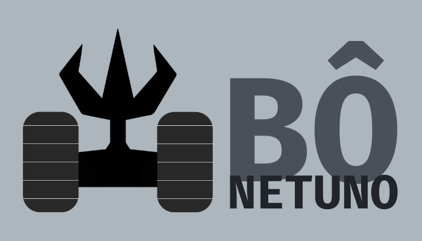
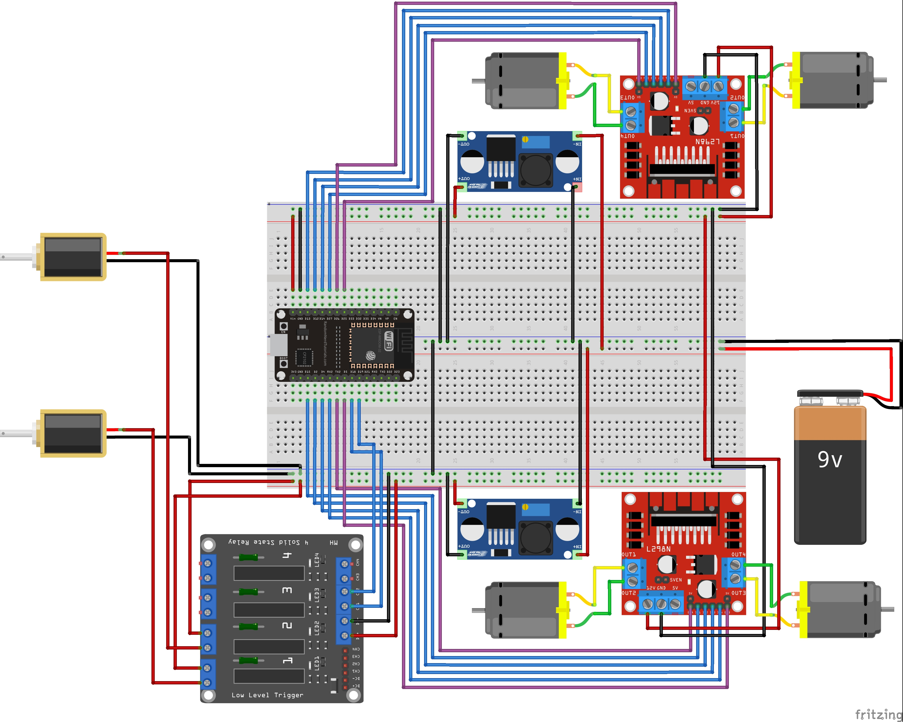
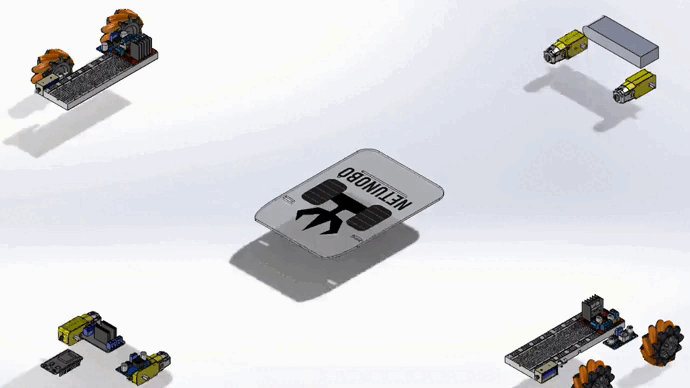

# Netunobô

> Um robô de combate omnidirecional com espinhos que é controlado por um controle de PlayStation via bluetooth.

## 📝 Sobre o projeto

Netunobô é um projeto de engenharia da computação que consiste em um robô espinho controlado por um controle de PS4. Possui dois espinhos acionados por solenóides, dois espinhos estáticos, quatro motores e quatro rodas omnidirecionais. O robô pode se mover em qualquer direção, com diferentes velocidades e rotações, além de ativar os espinhos de acordo com os botões pressionados no controle. O projeto utiliza uma placa ESP32 DevKit V1 como microcontrolador, e comunica-se com o controle de PS4 via Bluetooth.

## 🎯 Motivação

A robótica é a ciência que estuda as tecnologias para projetar e construir robôs, que são mecanismos automatizados que utilizam circuitos integrados para realizar atividades e funções humanas simples ou complexas. O “Netunobô” foi criado para ser um robô de combate, no qual tem o objetivo de lutar com outro robô, visando estourar balões que estão presos nas suas respectivas estruturas.

O projeto foi desenvolvido como parte prática do curso de engenharia da computação da Universidade Jorge Amado. O desafio proposto era construir um robô capaz de atacar o robô adversário usando algum tipo de arma. A inspiração veio do porco-espinho, um animal que usa seus espinhos como defesa contra predadores. Assim, surgiu a ideia de usar palitos de churrasco com agulhas nas pontas como espinhos do robô, que são acionados por solenoides.

O projeto envolveu diversas etapas, desde a concepção da ideia, a escolha dos materiais e componentes, a modelagem 3D da estrutura, a montagem do circuito elétrico, a programação do microcontrolador, a comunicação com o controle de PlayStation via bluetooth, até os testes finais de funcionamento e desempenho.

## 🛠 Requisitos

Para reproduzir o projeto, você vai precisar dos seguintes materiais e softwares:

### Materiais

| Item | Quantidade | Descrição |
| --- | --- | --- |
| ESP-32 | 1 | Microcontrolador programável em C++ com wifi e bluetooth integrado |
| Ponte H Dupla - L298N | 2 | Módulo que permite controlar a velocidade e a direção de dois motores DC |
| Módulo Relé - 5v 2 Canais | 1 | Módulo que permite acionar cargas de alta tensão e corrente usando sinais digitais |
| Módulo Regulador de Tensão - XL6009 | 1 | Módulo que permite ajustar a tensão de saída de acordo com a necessidade do circuito |
| Bateria Lipo - 2200mah 2s 7.4v 30c | 1 | Bateria recarregável que fornece a energia para o robô |
| Protoboard - 830 Pontos | 1 | Placa de ensaio que permite montar circuitos eletrônicos sem solda |
| Jumpers | Vários | Fios flexíveis que permitem conectar os componentes na protoboard |
| Motor DC 3-6V | 4 | Motor elétrico que converte energia elétrica em movimento rotacional |
| Roda Mecanum | 4 | Roda omnidirecional que permite que o robô se mova em qualquer direção sem precisar girar |
| Mini Solenoide - 6v 1a | 2 | Dispositivo que converte energia elétrica em movimento mecânico linear |
| Palito de Churrasco | 2 | Haste de madeira usada para fazer os espinhos do robô |
| Agulha | 2 | Objeto pontiagudo usado para perfurar os balões adversários |
| Acrílico 5mm | Vários | Material plástico usado para fazer a estrutura do robô |
| Parafuso e Porca | Vários | Elementos de fixação usados para montar a estrutura do robô |
| Controle de PlayStation 4 | 1 | Dispositivo sem fio que permite controlar o robô via bluetooth |

### Softwares

- [Arduino IDE](https://www.arduino.cc/en/software): ambiente de desenvolvimento integrado para programar o ESP-32 em C++
- [PS4Controller](https://github.com/aed3/PS4-esp32): biblioteca externa que facilita a comunicação entre o ESP-32 e o controle de PlayStation via bluetooth
- [SixaxisPairer](https://github.com/sixaxispairer/sixaxispairer): software que permite alterar o endereço bluetooth do controle de PlayStation para pareá-lo com o ESP-32
- [PlatformIO](https://platformio.org/): extensão para o Visual Studio Code que permite gerenciar projetos, bibliotecas e placas para programação embarcada
- [Fritzing](https://fritzing.org/home/): software que permite criar esquemas elétricos de forma simples e intuitiva
- [Solidworks](https://www.solidworks.com/): software que permite criar modelos 3D de forma precisa e detalhada

## 🔌 Diagrama elétrico

O diagrama elétrico do projeto mostra como os componentes estão conectados entre si e com o ESP-32. Foi utilizado o software Fritzing para criar o diagrama de forma simples e intuitiva. Você pode ver o diagrama abaixo:

> 
> > O diagrama elétrico indica uma bateria de 9v, porém a utilizada foi uma bateria de 7.4v

## 🛸 Modelo 3D

O modelo 3D do projeto mostra como a estrutura do robô foi feita usando acrílico de 5 mm de espessura. Foi utilizado o software Solidworks para criar o modelo de forma precisa e detalhada. Você pode ver o modelo abaixo:

> 
> > Animação de montagem do robô

## 🧠 Estratégias

As estratégias utilizadas para o robô de combate foram as seguintes:

- Usar o ESP-32 como microcontrolador principal do robô, aproveitando sua capacidade de comunicação via bluetooth e sua facilidade de programação em C++
- Usar o controle de PlayStation como dispositivo de controle remoto do robô, aproveitando sua ergonomia, sua precisão e sua variedade de botões, gatilhos e analógicos
- Usar a biblioteca PS4Controller para facilitar a comunicação entre o ESP-32 e o controle de PlayStation via bluetooth, evitando ter que implementar o protocolo L2CAP manualmente
- Usar pontes H duplas para controlar os motores DC que movem as rodas do robô, aproveitando sua simplicidade, sua eficiência e sua versatilidade
- Usar rodas omnidirecionais para permitir que o robô se mova em qualquer direção sem precisar girar, aproveitando sua agilidade, sua flexibilidade e sua manobrabilidade
- Usar solenoides para ativar os espinhos do robô, aproveitando seu baixo custo, sua alta capacidade de exercer força e sua rapidez
- Usar módulos relé para acionar os solenoides do robô, aproveitando sua segurança, sua confiabilidade e sua compatibilidade
- Usar acrílico como material da estrutura do robô, aproveitando sua durabilidade, sua leveza e seu baixo custo
- Usar uma bateria Lipo como fonte de alimentação do robô, aproveitando sua alta capacidade, sua longa vida útil e sua recarga rápida
  
## 🔧 Instalação

Para instalar o projeto, você precisa seguir os seguintes passos:

1. Clone este repositório para a sua máquina local usando o comando git clone ``https://github.com/user/netunobo.git``
2. Abra o projeto no ``Visual Studio Code`` com a extensão ``PlatformIO`` instalada
3. Conecte o ESP-32 ao seu computador usando um cabo USB
4. Selecione a placa ``ESP32 Dev Module`` e a porta serial correspondente no ``PlatformIO``
5. Clique no botão ``Upload and Monitor`` para compilar e enviar o código para o ESP-32 e abrir o monitor serial
6. Baixe e instale o software ``SixaxisPairer`` no seu computador
7. Conecte o controle de PlayStation ao seu computador usando um cabo USB
8. Abra o software ``SixaxisPairer`` e clique no botão “Change Master”
9. Digite o endereço bluetooth do ESP-32, que é mostrado no monitor serial, e clique em ``Update``
10. Desconecte o controle de PlayStation do seu computador e pressione o botão PS para pareá-lo com o ESP-32 via bluetooth
11. Verifique se o monitor serial mostra a mensagem ``The controller has connected!``
12. Desconecte o cabo USB e conecte a bateria Lipo ao regulador de tensão
13. Ajuste a tensão de saída do regulador para 5V usando um multímetro
14. Ligue o interruptor do módulo relé para acionar os solenoides
15. Enjoy!

## 🕹 Instruções

Para usar o projeto, você precisa seguir os seguintes passos:

1. Coloque o robô em uma superfície satisfatóriamente plana
2. Ligue o controle de PlayStation 4 e pressione o botão PS para pareá-lo com o ESP-32 via bluetooth
3. Use os analógicos, os gatilhos e os botões do controle para movimentar o robô
4. Os analógicos controlam a direção e a velocidade do robô
5. Os gatilhos controlam a aceleração e a frenagem do robô
6. Os botões L1 e R1 ativam os espinhos esquerdo e direito, respectivamente

## 💻 Estrutura do código

O código foi escrito em C++ e consiste em três classes principais: ``RobotController``, ``RobotMotor`` e ``PS4Controller``. A classe ``RobotController`` é responsável por inicializar e atualizar o estado do controle de PlayStation, lendo os valores dos botões, dos gatilhos e dos analógicos e detectando mudanças de estado. A classe ``RobotMotor`` é responsável por inicializar e controlar os motores DC que movem as rodas do robô, usando uma ponte H dupla para variar a velocidade e a direção de cada motor. A classe ``PS4Controller`` é a biblioteca externa utilizada para comunicar com o controle de PlayStation via bluetooth.

## 🎮 Movimentação do robô

A movimentação do robô é feita usando quatro rodas omnidirecionais, que permitem que ele se mova em qualquer direção sem precisar girar. As rodas são acionadas por motores DC que são controlados por pontes H duplas. A direção e a velocidade do robô são determinadas pelos valores dos analógicos e dos gatilhos do controle de PlayStation, que são lidos pelo ESP-32 via bluetooth.

As rodas omnidirecionais são constituídas de roletes colocados na periferia da roda. Enquanto elas fornecem tração no sentido normal ao eixo do motor, a roda é capaz de deslizar sem fricção no sentido tangencial ao eixo do motor. Isto é possível porque cada rolete gira livremente em torno de seu próprio eixo.

A vantagem das rodas omnidirecionais é que elas permitem que o robô se mova em qualquer direção sem precisar girar, aumentando sua agilidade e flexibilidade. Além disso, elas permitem que o robô gire em torno do seu centro, facilitando sua manobra.

## ⚙ Princípios de funcionamento

O princípio de funcionamento do robô é baseado na comunicação entre o ESP-32 e o controle de PlayStation via bluetooth, usando a biblioteca PS4Controller. Essa biblioteca permite ler os valores dos botões, dos gatilhos e dos analógicos do controle e detectar mudanças de estado. Esses valores são usados para controlar os motores DC que movem as rodas do robô, usando pontes H duplas para variar a velocidade e a direção de cada motor. Além disso, os valores dos botões L1 e R1 são usados para acionar os solenoides que ativam os espinhos do robô, usando módulos relé para ligar e desligar as cargas de alta tensão e corrente. O botão PS é usado para desligar o robô e desconectar o controle via bluetooth.

O ESP-32 é um microcontrolador programável em C++ com wifi e bluetooth integrado. Ele possui 36 pinos GPIO (General Purpose Input/Output), que podem ser configurados como entradas ou saídas digitais ou analógicas. Ele também possui interfaces como UART, SPI, I2C, PWM, ADC e DAC, que permitem a comunicação com diversos tipos de sensores e atuadores.

A ponte H dupla é um módulo que permite controlar a velocidade e a direção de dois motores DC usando sinais digitais. Ela possui quatro transistores que formam uma ponte entre a fonte de alimentação e os terminais dos motores. Ao alternar o estado dos transistores, é possível inverter a polaridade da tensão aplicada aos motores, fazendo-os girar para frente ou para trás. Além disso, é possível variar a velocidade dos motores usando PWM (Pulse Width Modulation), que consiste em enviar pulsos de tensão com diferentes larguras e frequências.

O módulo relé é um módulo que permite acionar cargas de alta tensão e corrente usando sinais digitais. Ele possui um eletroímã que, quando energizado, atrai um contato metálico que fecha o circuito da carga. Assim, é possível ligar e desligar dispositivos como lâmpadas, motores e solenoides usando um sinal digital de baixa tensão e corrente.

O módulo regulador de tensão é um módulo que permite ajustar a tensão de saída de acordo com a necessidade do circuito. Ele possui um potenciômetro que, ao ser girado, altera o valor da resistência interna do módulo, modificando a tensão de saída. Assim, é possível usar uma fonte de alimentação de maior tensão e reduzi-la para o valor desejado.

## 📄 Documentação

Todo o projeto (ou pelo menos maior parte dele :x) foi documentado utilizando o JavaDoc. É possível ter acesso através
do link: https://reedbluue.github.io/netunobo

## 🤝 Reconhecimentos

* [PS4Controller](https://github.com/aed3/PS4-esp32), criada por [Augusto E. Duarte](https://github.com/aed3), que me permitiu comunicar com o controle de PlayStation via bluetooth usando o ESP-32 com extrema facilidade ;D

## 🙋🏾‍♂️ Autor

* [Igor E. Oliveira](https://github.com/reedbluue) - Just another person

## 📜 Licença

Este projeto está licenciado sob a licença Apache - veja o arquivo [LICENSE](./LICENSE) para mais detalhes.
